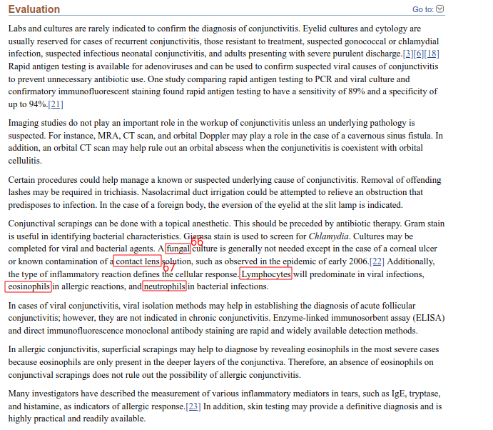

# Diagnostic impact of signs and symptoms in acute infectious conjunctivitis: systematic literature search (789.1.full.pdf)

https://www.bmj.com/content/327/7418/789.1.short

- 1: говорится, что есть течение "острое"

- 2: говорится, что есть "бактериальный" конъюнктивит

- 3: говорится, что есть "вирусный" конъюнктивит

- 4: симптом вирусного конъюнктивита

- 5: симптом вирусного конъюнктивита

- 6: симптом бактериального конъюнктивита

- 7: симптом бактериального конъюнктивита

- 8: симптом бактериального конъюнктивита

- 9: симптом вирусного конъюнктивита

- 10: симптом бактериального конъюнктивита

- 11: симптом бактериального конъюнктивита

- 12: вид

- 13: причина

- 14: причина

Rietveld R. P. et al. Diagnostic impact of signs and symptoms in acute infectious conjunctivitis: systematic literature search //Bmj. – 2003. – Т. 327. – №. 7418. – С. 789.

# Conjunctivitis (Conjunctivitis - StatPearls - NCBI Bookshelf.pdf)

https://www.ncbi.nlm.nih.gov/books/NBK541034/

- 1: последствие

- 2: течение острое

- 3: течение хроническое

- 4: причина

- 5: причина

- 6: причина

- 7: причина

- 8: причина

- 9: причина

- 10: причина

- 11: причина

- 12: вид

- 13: вид

- 14: вид

- 15: вид

- 16: вид

- 17: вид

- 18: возбудитель

- 19: возбудитель

- 20: возбудитель

- 21: возбудитель

- 22: возбудитель

- 23: возбудитель

- 24: возбудитель

- 25: возбудитель

- 26: возбудитель

- 27: возбудитель

- 28: возбудитель

- 29: возбудитель

- 30: возбудитель

- 31: возбудитель

- 32: возбудитель

- 33: возбудитель

- 34: возбудитель

- 35: возбудитель

- 36: возбудитель

- 37: возбудитель

- 38: возбудитель

- 39: симптом

- 40: симптом

- 41: симптом

- 42: симптом

- 43: симптом

- 44: симптом

- 45: симптом

- 46: симптом

- 47: симптом

- 48: симптом

- 49: симптом

- 50: симптом

- 51: симптомы

- 52: осложнение

- 53: осложнение

- 54: осложнение

- 55: симптом

- 56: симптом

- 57: симптом

- 58: симптом

- 59: симптом

- 60: симптом

- 61: осложнение

- 62: симптом

- 63: симптомы бактериального конъюнктивита

- 64: симптомы вирусного конъюнктивита

- 65: симптомы аллергического конъюнктивита

- 66: вид

- 67: причина

- 68: осложнения

- 69: осложнения

- 70: причины

Ryder E. C., Benson S. Conjunctivitis //StatPearls [Internet]. – StatPearls Publishing, 2022.

# Epidemiology of allergic conjunctivitis (Epidemiology of allergic conjunctivitis _ Current Opinion in Allergy and Clinical Immunology.pdf)

https://journals.lww.com/co-allergy/abstract/2011/10000/epidemiology_of_allergic_conjunctivitis.14.aspx

- 1: вид

- 2: форма

- 3: симптом

- 4: симптом

Rosario N., Bielory L. Epidemiology of allergic conjunctivitis //Current opinion in allergy and clinical immunology. – 2011. – Т. 11. – №. 5. – С. 471-476.

<!--

https://onlinelibrary.wiley.com/doi/full/10.1111/j.1600-0420.2007.01006.x
Høvding, Gunnar. "Acute bacterial conjunctivitis." Acta ophthalmologica 86.1 (2008): 5-17.
(вид бактериальный, симптомы, лечение)

https://jamanetwork.com/journals/jama/article-abstract/1758756
(виды, симптомы, причины, течение, лечение)
Azari A. A., Barney N. P. Conjunctivitis: a systematic review of diagnosis and treatment //Jama. – 2013. – Т. 310. – №. 16. – С. 1721-1730.
https://probolezny.ru/konyunktivit/

-->
