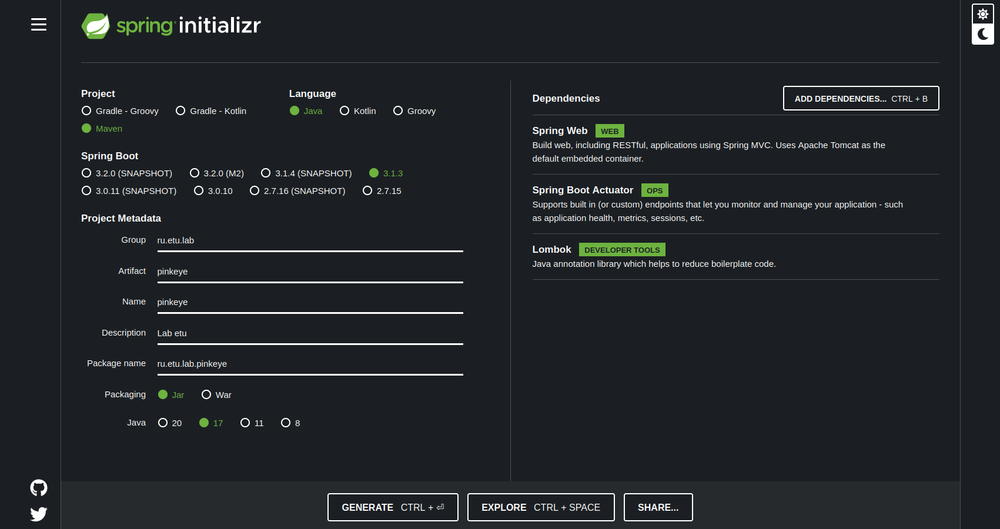

# etu2023_SpringTest

Разработка приложений в распределенной среде

# Необходимые пакеты

``` bash
yay jdk-openjdk # java хотя бы 17
archlinux-java get # get current verison
archlinux-java status # list of available verison
sudo archlinux-java set java-17-openjdk # set the required verison, such as java-17-openjdk

yay maven

yay intellij-idea-community-edition

yay postman-bin
```

# Инициализация шаблона

https://start.spring.io/



# Необходимые плагины

Нужно установить в `IntelliJ` плагин `Lombok`.

# Задания

## Первая работа

- Провести анализ предметной области на предмет выявления её характеристик (найти три научных статьи с высоким индексом цитируемости на https://scholar.google.com/).

- Реализовать классы контроллера, модели и службы.

2.1. Количество полей в классе модели – не менее шести.

2.2. Класс службы должен содержать четыре метода (создание, чтение, модификация, удаление).

2.3. Класс контроллера должен содержать четыре метода, которые реализуют HTTP-запросы POST, GET, PUT, DELETE соответственно.

- Выполнить запуск приложения.

- Выполнить обращение к конечным точкам (запросы POST, GET, PUT, DELETE) с использованием Postman.

## Вторая работа (1)

- Реализовать в приложении перевод сообщений, уведомляющих о создании, модификации и удалении объекта модели на три языка:

1.1. русский;

1.2. английский;

1.3. язык согласно номеру варианта (чешский).

- Выполнить запуск приложения.

- Выполнить обращение к конечным точкам (запросы POST, PUT, DELETE) с использованием заголовка Accept-language в Postman.

## Вторая работа (2)

- Реализовать в приложении вывод ссылок на выполнение действий с ресурсом (получение, создание, модификация, удаление) в ответе на вызов конечной точки GET c использованием Spring HATEOAS.

- Предусмотреть наличие перевода имени для URL-адреса на следующие языки:

2.1. юрусский;

2.2. английский;

2.3. язык согласно номеру варианта (из первой части работы).

- Выполнить запуск приложения (чешский).

- Выполнить обращение к конечным точкам (запрос GET) с использованием заголовка Accept-language в Postman.

## Вторая работа (3)

- Выполнить запросы GET в Postman к следующим конечным точкам:

1.1. /actuator;

1.2. /actuator/health c отображением дополнительной информации, доступной для просмотра всем пользователям;

1.3. /actuator/info с информацией о сборке и пользовательских данных (название приложения, описание, разработчик, e-mail).

- Изучить описания конечных точек (https://docs.spring.io/spring-boot/docs/current/actuator-api/htmlsingle/) и вывести следующую информацию через запросы GET в Postman:

2.1. список метрик и значения конкретных метрик (время для запуска приложения, длительность обработки запроса HTTP-сервером, число доступных процессоров для JVM);

2.2. данные об окружении;

2.3. данные о bean-компонентах приложения.

## Третья работа (1)

- Скачать, установить и запустить PostgreSQL.

- Создать новую роль с полными правами.

- Создать базу данных, указав в качестве владельца созданную роль.

- Создать таблицу в базе данных, указав в качестве владельца созданную роль. Столбцы таблицы должны соответствовать переменным класса модели.

## Третья работа (2)

- Создать проект Spring Boot с помощью Spring Initializr для сервера конфигурации.

- Создать файл свойств приложения.

- Создать файлы конфигурации для трех различных окружений.

- Реализовать класс инициализации.

- Выполнить запросы GET к конечным точкам с использованием Postman, ответы на которые содержат сведения о конфигурации для трех различных окружений.

## Третья работа (3)

- Выполнить запуск сервера конфигураций.

- Выполнить запуск сервера PostgreSQL, используя pgAdmin.

- Добавить в файл pom.xml сведения о версии Spring Cloud и необходимые зависимости.

- Создать файл с настройками для подключения к серверу конфигураций.

- Создать интерфейс Repository и класс ServiceConfig.

- Модифицировать код в классах инициализации, модели, сервиса и контроллера.

- Выполнить запуск приложения.

- Выполнить обращение к конечным точкам (запросы POST, GET, PUT, DELETE) с использованием Postman.

- Продемонстрировать изменение данных в таблице базы данных с использованием pgAdmin.

# Запуск приложения

Зайти на адрес `http://127.0.0.1:8080/hospital/pinkeye/{patient_id}`

# Демонстрация

Для тестирования нужен пакет `requests`:

``` bash
pip3 install requests
```

## Демонстрация первой работы (aka lab1)

В директории `py` лежат скрипты:

- `lab_test_1.py`

- `lab_test_2.py`

- `lab_test_3.py`

- `lab_test_4.py`

## Демонстрация второй работы (1) (aka lab2.1)

В директории `py` лежат скрипты, но нужно менять переменную LOCALE:

- `lab_test_1.py`

- `lab_test_2.py`

- `lab_test_3.py`

- `lab_test_4.py`

## Демонстрация второй работы (2) (aka lab2.2)

В директории `py` лежит скрипт `lab_test_2.py`. Нужно менять переменную LOCALE.

## Демонстрация второй работы (3) (aka lab2.3)

Переходить по ссылкам

- http://127.0.0.1:8080/actuator

- http://127.0.0.1:8080/actuator/health

- http://127.0.0.1:8080/actuator/info

- http://localhost:8080/actuator/beans (данные о bean-компонентах приложения)

- http://localhost:8080/actuator/env (данные об окружении)

- http://localhost:8080/actuator/metrics (все метрики)

- http://localhost:8080/actuator/metrics/application.started.time (метрика: время для запуска приложения)

- http://localhost:8080/actuator/metrics/http.server.requests (метрика: длительность обработки запроса HTTP-сервером)

- http://localhost:8080/actuator/metrics/system.cpu.count (метрика: число доступных процессоров для JVM)

## Демонстрация третьей работы (1) (aka lab3.1)

<!-- https://slurm.io/blog/tpost/i5ikrm9fj1-hranenie-dannih-v-docker -->

См. директорию `postgres`.

Команда для запуска: `docker-compose --project-name="pg-14" up`

## Демонстрация третьей работы (2) (aka lab3.2)

См. директорию `config_server`.

Запустить там проект в IDEA. Перейти по адресам:

- http://localhost:8071/pinkeye/default

- http://localhost:8071/pinkeye/dev

- http://localhost:8071/pinkeye/prod

## Демонстрация третьей работы (3) (aka lab3.3)

Не используйте `javax`.

В директории `py` лежат скрипты:

- `lab_test_1.py`

- `lab_test_2.py`

- `lab_test_3.py`

- `lab_test_4.py`
